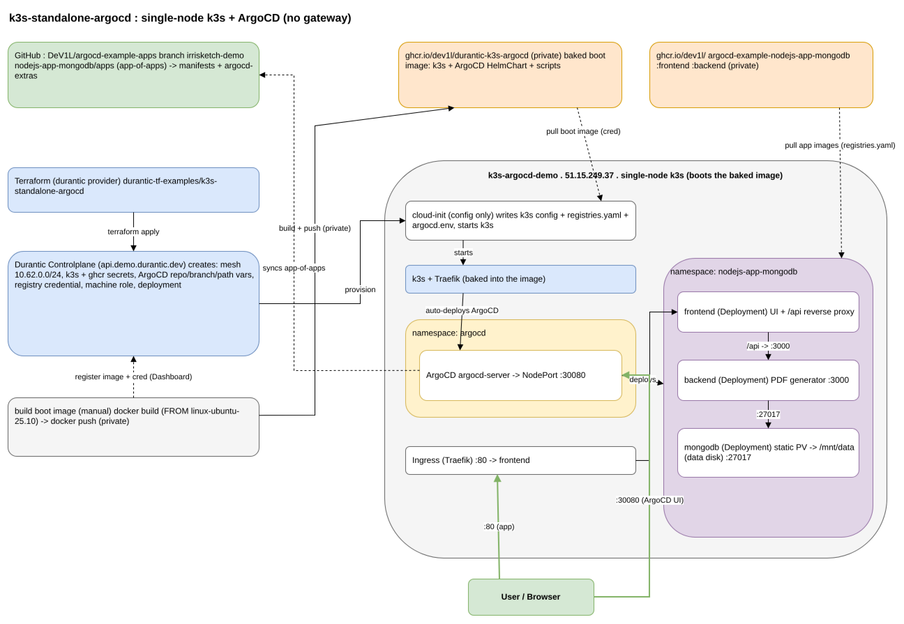
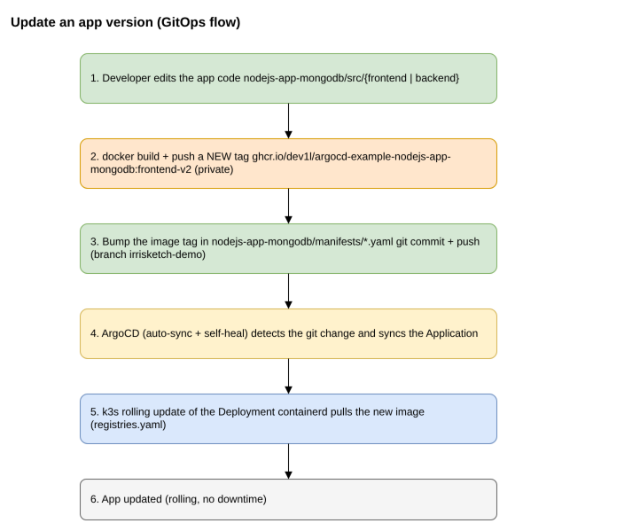
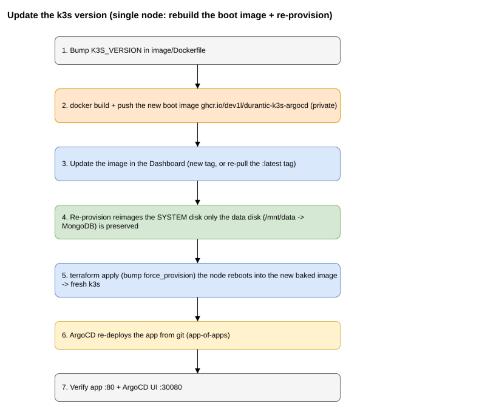

# k3s-standalone-argocd

Provisions **one** existing Durantic machine into a **single-node k3s cluster with ArgoCD**
(standalone — no gateway, no VIP) and lets ArgoCD deploy a three-tier Node.js + MongoDB
app from a GitOps repo.

It is the Kubernetes counterpart of [`nodejs-app-mongodb`](../nodejs-app-mongodb) (which
runs the same app directly on three bare-metal machines): here the app runs as Kubernetes
workloads, delivered by ArgoCD.



Diagram source: [`assets/k3s-standalone-argocd.drawio`](assets/k3s-standalone-argocd.drawio) (3 pages —
open with [diagrams.net](https://app.diagrams.net) or the VS Code Draw.io extension). The
PNGs in [`assets/`](assets) are exported from it (see *Regenerating the diagram images*).

## What it builds

- A **baked boot image** ([`image/`](image)) `FROM ghcr.io/durantic/linux-ubuntu-25.10:latest`
  with **k3s + the ArgoCD HelmChart manifest + bootstrap scripts baked in** — pushed
  **private** to `ghcr.io/dev1l/durantic-k3s-argocd` and registered in the account with a
  registry credential.
- A custom `durantic_machine_role` whose cloud-init is **config-only** — it writes
  `k3s config.yaml` + `registries.yaml` + `argocd.env` and starts k3s. k3s auto-deploys ArgoCD from the baked HelmChart, then the baked
  `argocd-app-bootstrap.sh` creates the **app-of-apps** `Application`.
- A fresh mesh network (`10.62.0.0/24`) and uniquely-named secrets/variables
  (`K3S_STANDALONE_ARGOCD_*`).
- The node's own public IP serves both the app (Traefik ingress, `:80`) and the ArgoCD UI
  (NodePort, `:30080`). The k8s API is published on the public IP automatically.
- **Persistent data on the node's second disk.** The role mounts the secondary
  (`data`) disk at `/mnt/data` (`mount-data-disk.sh`, baked) — formatting it *only* if
  it has no filesystem yet, so data is preserved. MongoDB uses a **static PV pinned to
  `/mnt/data/mongodb`**. Durantic reimages only the *system* disk on a re-provision, so
  **MongoDB data survives re-provisions**.

ArgoCD deploys from **`github.com/DeV1L/argocd-example-apps`**, branch `irrisketch-demo`,
path `nodejs-app-mongodb/apps` (app-of-apps) → `nodejs-app-mongodb/manifests` (frontend,
backend, `mongo:8.0`).

## Prerequisites

- A registered, online Durantic machine to use as the node (default hostname
  `k3s-argocd-demo`).
- The two app images pushed to `ghcr.io/dev1l/argocd-example-nodejs-app-mongodb`
  (`:frontend`, `:backend`) — see the app repo's README.

### 1. Build + push the baked boot image (one-time)

```bash
echo "$GHCR_TOKEN" | docker login ghcr.io -u dev1l --password-stdin   # PAT, write:packages
tar -czh -C image . | docker build --provenance=false -t ghcr.io/dev1l/durantic-k3s-argocd:latest -
docker push ghcr.io/dev1l/durantic-k3s-argocd:latest
```

### 2. Register the credential + image in the Dashboard (one-time)

In the Durantic Dashboard:

1. **Registry credentials** → add `ghcr.io` with username `dev1l` and your ghcr.io PAT
   (so the controlplane can pull the private boot image).
2. **Images** → add `ghcr.io/dev1l/durantic-k3s-argocd:latest`, name it
   `durantic-k3s-argocd:latest`, and attach the credential above.

Terraform looks this image up by name via `data.durantic_image`.

### 3. Provider credentials for `terraform`

```bash
export DURANTIC_ENDPOINT="https://api.demo.durantic.dev"
export DURANTIC_API_TOKEN="dur_..."
export TF_VAR_ghcr_token="ghp_..."           # ghcr.io PAT — node pulls the private app images
export TF_VAR_k3s_cluster_token="$(openssl rand -hex 32)"   # optional
```

## Usage

```bash
terraform init
terraform plan
terraform apply
```

`apply` re-provisions the node — it reboots into the **baked** image, then cloud-init just
writes config and starts k3s. Provisioning the OS completes within the apply;
k3s/ArgoCD/app come up shortly after.

## Verify

```bash
terraform output            # app_url, argocd_url, password hint

# On the node:
ssh root@<node-public-ip> 'k3s kubectl get nodes'
ssh root@<node-public-ip> 'k3s kubectl get applications -n argocd'
ssh root@<node-public-ip> 'k3s kubectl get pods -n nodejs-app-mongodb'

# App (frontend -> backend -> mongo):
curl http://<node-public-ip>/
curl -X POST http://<node-public-ip>/api/generate \
  -H 'content-type: application/json' -d '{"text":"hello durantic"}'
curl http://<node-public-ip>/api/documents

# ArgoCD UI: http://<node-public-ip>:30080  (user: admin)
ssh root@<node-public-ip> \
  "k3s kubectl -n argocd get secret argocd-initial-admin-secret -o jsonpath='{.data.password}' | base64 -d"
```

## Files

| File | Purpose |
|------|---------|
| `image/Dockerfile` + scripts | the baked boot image (k3s + ArgoCD manifest + bootstrap scripts) |
| `main.tf` | provider, mesh, secrets/variables, roles, deployment |
| `variables.tf` | node hostname, SSH users, ArgoCD repo/branch/path, tokens |
| `outputs.tf` | app/ArgoCD URLs, node info, provision status |
| `templates/k3s-argocd.cloud-init.yaml` | **config-only** cloud-init: writes k3s config + registries.yaml + argocd.env, starts k3s |
| `assets/` | PNGs exported from the `.drawio` (architecture + day-2 flows) |

## Day-2 operations

**Update an app version** (GitOps — no re-provision):



**Update the k3s version** (rebuild the boot image + re-provision; MongoDB data on the
data disk is preserved):



## Regenerating the diagram images

The PNGs are exported from `assets/k3s-standalone-argocd.drawio` with the **drawio CLI**
(drawio-desktop in headless `--export` mode). Pick one:

- **Docker (no install):**
  ```bash
  docker run --rm -v "$PWD:/data" rlespinasse/drawio-desktop-headless \
    --no-sandbox -x -f png -s 1 -b 10 -o /data/assets/architecture.png /data/assets/k3s-standalone-argocd.drawio
  ```
  Repeat per page (the `--page-index` flag is unreliable in this image — split the file
  into single-page `.drawio`s, or use a real install below).
- **Windows (Draw.io Desktop):** `winget install jgraph.draw`, then
  `& "draw.io.exe" -x -f png -p 0 -o assets/architecture.png assets/k3s-standalone-argocd.drawio`.
- **Linux/WSL (Draw.io Desktop .deb):** download from
  [jgraph/drawio-desktop releases](https://github.com/jgraph/drawio-desktop/releases),
  `sudo apt install ./drawio-amd64-<ver>.deb`, then
  `xvfb-run -a drawio -x -f png -p 0 -o assets/architecture.png assets/k3s-standalone-argocd.drawio`.
